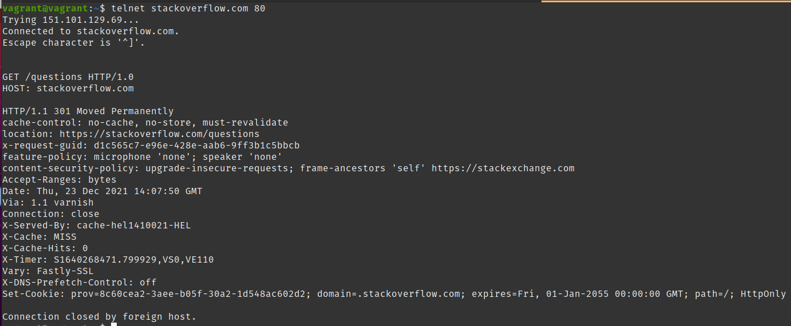
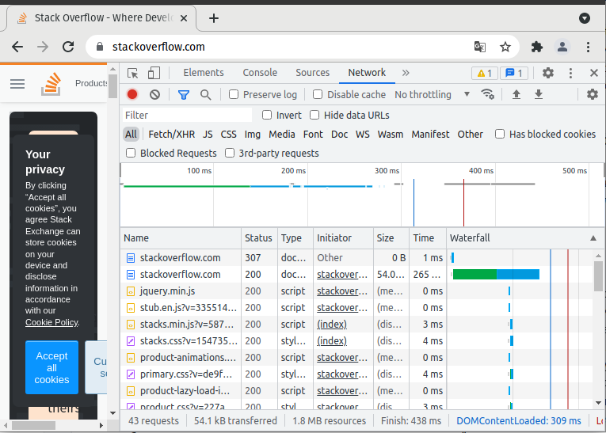
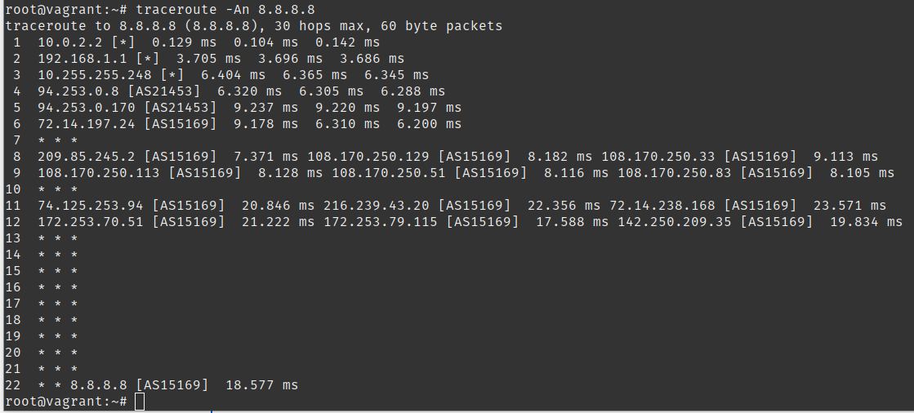
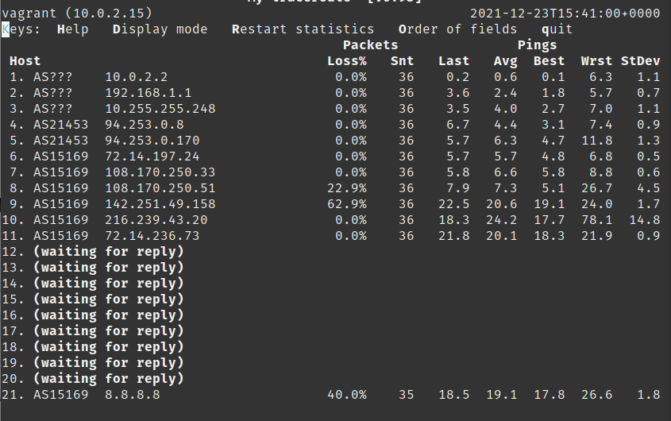
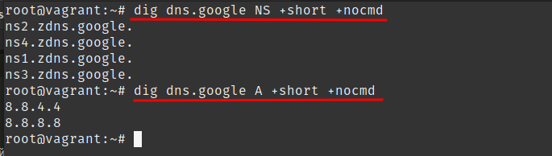

# Выполненные задания к занятию "03-sysadmin-06-net"

[**Ответы: 03-sysadmin-06-net**](03-sysadmin-06-net.md) 

--- 


# Домашнее задание к занятию "3.6. Компьютерные сети, лекция 1"

1. Работа c HTTP через телнет.
- Подключитесь утилитой телнет к сайту stackoverflow.com
`telnet stackoverflow.com 80`
- отправьте HTTP запрос
```bash
GET /questions HTTP/1.0
HOST: stackoverflow.com
[press enter]
[press enter]
```
- В ответе укажите полученный HTTP код, что он означает?
> ` HTTP/1.1 301 Moved Permanently ` - Запрашиваемый ресурс перемещен; новый адрес в поле `location` в заголовках ответа:
> 


2. Повторите задание 1 в браузере, используя консоль разработчика F12.
- откройте вкладку `Network`
- отправьте запрос http://stackoverflow.com
- найдите первый ответ HTTP сервера, откройте вкладку `Headers`
- укажите в ответе полученный HTTP код.
> `307 Internal Redirect` - Запрашиваемый ресурс на короткое время доступен по адресу в поле `location` в заголовках


- проверьте время загрузки страницы, какой запрос обрабатывался дольше всего?
> Дольше всего загружается главная страница сайта: 
> ```yaml
> Request URL: https://stackoverflow.com/
> Request Method: GET
> Status Code: 200 
> Remote Address: 151.101.193.69:443
> ```

- приложите скриншот консоли браузера в ответ.
> 
>

3. Какой IP адрес у вас в интернете?
> `curl ifconfig.me` - 95.183.89.110

4. Какому провайдеру принадлежит ваш IP адрес? Какой автономной системе AS? Воспользуйтесь утилитой `whois`
> `whois 95.183.89.110` - `netname: FlexNet`, `% Information related to '95.183.64.0/18AS21453' ` 

5. Через какие сети проходит пакет, отправленный с вашего компьютера на адрес 8.8.8.8? Через какие AS? Воспользуйтесь утилитой `traceroute`
> `traceroute -A 8.8.8.8` - пакет проходит через 94, 72, 209, 108, 74, 172 сети. Номера AS - 21453, 15169
> 

6. Повторите задание 5 в утилите `mtr`. На каком участке наибольшая задержка - delay?
> `mtr -nz 8.8.8.8` - наибольшая задержка на участке между 9 и 10м участками - на 9м узле наибольший процент потери пакетов
> 

7. Какие DNS сервера отвечают за доменное имя dns.google? Какие A записи? воспользуйтесь утилитой `dig`
> 
> NS-записи:
> ns2.zdns.google
> ns4.zdns.google
> ns1.zdns.google
> ns3.zdns.google 
> A-записи: `8.8.8.8, 8.8.4.4`

8. Проверьте PTR записи для IP адресов из задания 7. Какое доменное имя привязано к IP? воспользуйтесь утилитой `dig`
В качестве ответов на вопросы можно приложите лог выполнения команд в консоли или скриншот полученных результатов.
 
```bash
root@vagrant:~# dig dns.google A +nocmd +short | sed 's/\.$//' > servers.txt
root@vagrant:~# dig dns.google NS +nocmd +short | sed 's/\.$//' >> servers.txt
root@vagrant:~# cat servers.txt
8.8.4.4
8.8.8.8
ns2.zdns.google
ns3.zdns.google
ns4.zdns.google
ns1.zdns.google

root@vagrant:~# while IFS= read -r line; do echo -x $line PTR +noall +answer >> PTR-IP.txt; done < servers.txt
root@vagrant:~# cat PTR-IP.txt 
-x 8.8.4.4 PTR +noall +answer
-x 8.8.8.8 PTR +noall +answer
-x ns2.zdns.google PTR +noall +answer
-x ns3.zdns.google PTR +noall +answer
-x ns4.zdns.google PTR +noall +answer
-x ns1.zdns.google PTR +noall +answer

root@vagrant:~# dig -f PTR-IP.txt 
4.4.8.8.in-addr.arpa.	67309	IN	PTR	dns.google.
8.8.8.8.in-addr.arpa.	4174	IN	PTR	dns.google.
```

[На главную](../README.md)