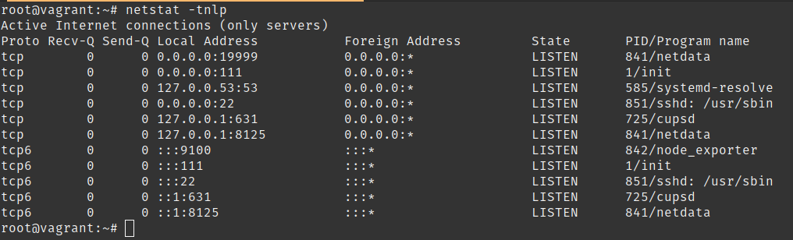
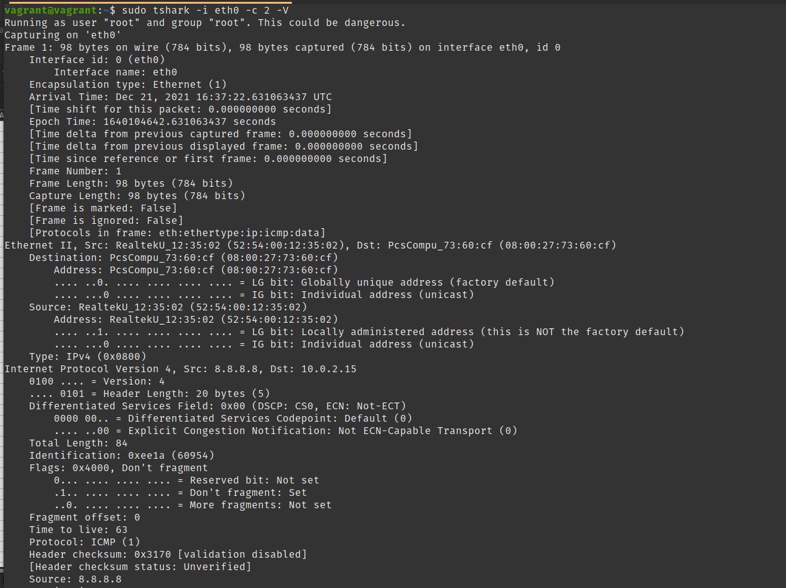

# Домашнее задание к занятию "3.6. Компьютерные сети, лекция 1"

1. Необязательное задание:
можно посмотреть целый фильм в консоли `telnet towel.blinkenlights.nl` :)
  > good))

1. Узнайте о том, сколько действительно независимых (не пересекающихся) каналов есть в разделяемой среде WiFi при работе на 2.4 ГГц. Стандарты с полосой 5 ГГц более актуальны, но регламенты на 5 ГГц существенно различаются в разных странах, а так же не раз обновлялись. В качестве дополнительного вопроса вне зачета, попробуйте найти актуальный ответ и на этот вопрос.
  > 2.4GHz: Всего 14 каналов, возможная ширина канала : 10, 20, 22, 40, 80 и 160 МГц; Основные 20 и 40.
  При ширине канала = 40 МГц - 3 непересекающихся канала: 1,6,11.
  Каналы 80 и 160 МГц в диапазон 2.4 ГГц, не имеют не пересекающихся каналов.
  > 5GHz РФ: 20Мгц - 17 каналов,40Мгц - 8, 80Мгц - 4, 160Мгц -1
  >

1. Адрес канального уровня – MAC адрес – это 6 байт, первые 3 из которых называются OUI – Organizationally Unique Identifier или уникальный идентификатор организации. Какому производителю принадлежит MAC `38:f9:d3:55:55:79`?
  > [IEEE.org](https://regauth.standards.ieee.org/standards-ra-web/pub/view.html#registries): 
  > 38-F9-D3 (hex) (38F9D3), **MA-L** 	Apple, Inc.,1 Infinite Loop,Cupertino CA 95014 US 
  > grep по `/usr/share/ieee-data/oui.txt` возвращает null - видимо записи устарели?)

1. Каким будет payload TCP сегмента, если Ethernet MTU задан в 9001 байт, размер заголовков IPv4 – 20 байт, а TCP – 32 байта?
  > payload TCP сегмента: 8949 = 9001 - 20 - 32
  > 
1. Может ли во флагах TCP одновременно быть установлены флаги SYN и FIN при штатном режиме работы сети? Почему да или нет?
  > Одновременная установка флагов FIN и SYN является недопустимой, т.к. состояние флагов установления соединения (SYN),  и завершения соединения (FIN) является взаимоисключающими и по разному обрабатывается операционными системами 
  >
  >
1. `ss -ula sport = :53` на хосте имеет следующий вывод:

```bash
State           Recv-Q          Send-Q                   Local Address:Port                     Peer Address:Port          Process
UNCONN          0               0                        127.0.0.53%lo:domain                        0.0.0.0:*
```

Почему в `State` присутствует только `UNCONN`, и может ли там присутствовать, например, `TIME-WAIT`?
  > UDP — это быстрый протокол, не гарантирующий доставки; Статус `TIME-WAIT` невозможен 
  >

7. Обладая знаниями о том, как штатным образом завершается соединение (FIN от инициатора, FIN-ACK от ответчика, ACK от инициатора), опишите в каких состояниях будет находиться TCP соединение в каждый момент времени на клиенте и на сервере при завершении. Схема переходов состояния соединения вам в этом поможет.

  > Инициатор отправляет пакет FIN и переходит в состояние FIN_WAIT_1;
  > Ответчик получает пакет FIN, переводит свое соединение в состояние CLOSE_WAIT и отправляет в ответ ACK;
  > Инициатор получает ACK и переходит в состояние FIN_WAIT_2;
  > Ответчик отправляет FIN и переходит в состояние LAST_ASK;
  > Инициатор получает FIN  переходит в состояние TIME_WAIT и отправляет Ответчику ASK;
  > Ответчик получает ASK для FIN и полностью удаляет соединение;
  > Инициатор, спустя time alive удаляет соединение. 

1. TCP порт – 16 битное число. Предположим, 2 находящихся в одной сети хоста устанавливают между собой соединения. Каким будет теоретическое максимальное число соединений, ограниченное только лишь параметрами L4, которое параллельно может установить клиент с одного IP адреса к серверу с одним IP адресом? Сколько соединений сможет обслужить сервер от одного клиента? А если клиентов больше одного?
  > Сеанс ТСР определен 4-мя параметрами `client ip : source port  -> server ip : destination port';  
  > Теоретичиски каждый из клиентов может установить 65535 соединений с сервером.
  >

1. Может ли сложиться ситуация, при которой большое число соединений TCP на хосте находятся в состоянии  `TIME-WAIT`? Если да, то является ли она хорошей или плохой? Подкрепите свой ответ пояснением той или иной оценки.
  > При частом соединении и отключении создается соединение и соотвествено выделяется каждый раз порт,
    при этом предыдущая сессия все еще находится в "карантине" и может начаться новая сессия; большое количество "таких"  соединений вызывают накопление.
  >

1. Чем особенно плоха фрагментация UDP относительно фрагментации TCP?
  > в UDP нет контроля ошибок - если фрагмент пакета не дойдет, то придется послать весь пакет еще раз
  >

1. Если бы вы строили систему удаленного сбора логов, то есть систему, в которой несколько хостов отправяют на центральный узел генерируемые приложениями логи (предположим, что логи – текстовая информация), какой протокол транспортного уровня вы выбрали бы и почему? Проверьте ваше предположение самостоятельно, узнав о стандартном протоколе syslog.
  > Передача сообщений Syslog началсь с протокола UDP, далее в связи с повышением требований гарантирующих доставку сообщений произошел переход на TCP. 
  > При проектировании системы удаленного сбора логов я бы использовал показатели SLA при выборе протокола взаимодействия: для Клиентов с высоким уровнем SLA использовал бы TCP, остальные по UDP(ресурсы не резиновые).

1. Сколько портов TCP находится в состоянии прослушивания на вашей виртуальной машине с Ubuntu, и каким процессам они принадлежат?
  >  
  > с помощью команды `netstat -tnlp` (TCP, Num addr, LISTEN, PID & Name) определил в состоянии прослушивания 11 портов (6ipv4+5ipv6) с процессами: netdata, systemd, init, sshd, cupsd, node_exporter
  >

1. Какой ключ нужно добавить в `tcpdump`, чтобы он начал выводить не только заголовки, но и содержимое фреймов в текстовом виде? А в текстовом и шестнадцатиричном?
  > `tcpdump -A` - выведет содержание в ASCII 
  > `tcpdump -x` - выведет содержание в hex 

1. Попробуйте собрать дамп трафика с помощью `tcpdump` на основном интерфейсе вашей виртуальной машины и посмотреть его через tshark или Wireshark (можно ограничить число пакетов `-c 100`). Встретились ли вам какие-то установленные флаги Internet Protocol (не флаги TCP, а флаги IP)? Узнайте, какие флаги бывают. Как на самом деле называется стандарт Ethernet, фреймы которого попали в ваш дамп? Можно ли где-то в дампе увидеть OUI?
  > с помощью команды `sudo tshark -i eth0 -c 2 -V` рассмотрел детали пакета:
  > Flags: 0x4000, Don't fragment
  >      0... .... .... .... = Reserved bit: Not set
  >      .1.. .... .... .... = Don't fragment: Set
  >      ..0. .... .... .... = More fragments: Not set
  > 
  > Ethernet II, Src: PcsCompu_73:60:cf (08:00:27...), Dst: RealtekU_12:35:02 (52:54:00...)
  > 


 
[На главную](../README.md)